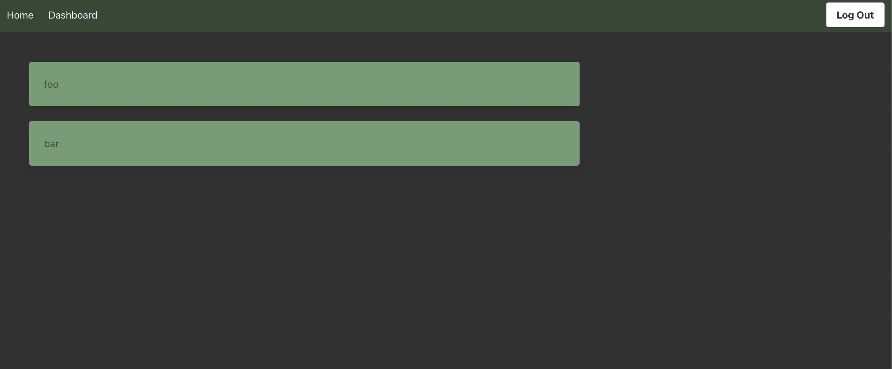

# Tech Blog

## Description

This project showcases the use of MVC framework using sql, sequelize, handlebars, express and other tools.

  ## Table of Contents
1. [Usage](#usage)
2. [Contributing](#contributing)
3. [Questions](#questions)

## Usage

Users can navigate to the the website via this url: <a href="https://techblog-bootcamp-harry.herokuapp.com/">https://techblog-bootcamp-harry.herokuapp.com/</a>

Users are presented with a homepage:

From there, the user can login or create an account and post content or post comments on existing content.

## Contributing

<a href="https://github.com/harryhamlin">github.com/harryhamlin</a>

## Questions

For any questions, please reach out directly to <a href="mailto:harryhamlin@gmail.com" target="_blank">harryhamlin@gmail.com</a>.

